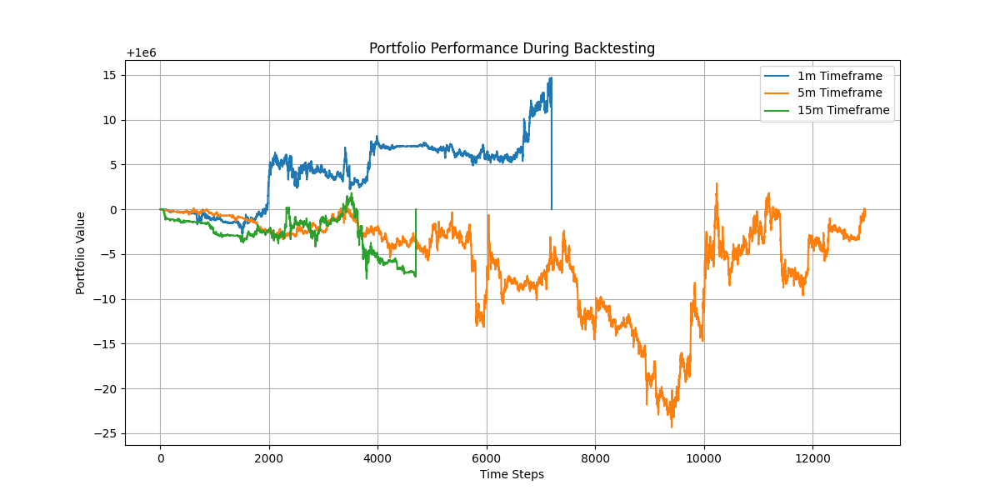

# Crypto Derivatives Trading Bot

This repository contains a Python-based trading bot for crypto derivatives markets. The bot leverages **Deep Reinforcement Learning (DRL)**, utilizing the **FinRL framework** for training and optimization. It integrates with Bybit's Testnet API for executing trades in a simulated environment, providing insights into market positions, stop-loss, and take-profit levels.

## Features

- **Deep Reinforcement Learning**: Utilizes FinRL framework for policy optimization.
- **Bybit Testnet Integration**: For live simulation of trades.
- **Risk Management**: Implements stop-loss and take-profit levels.
- **Dataset Preparation**: Historical data fetched and processed using Binance History and custom feature engineering.

---

## Prerequisites

1. Python 3.8 or later
2. Bybit Testnet API key

---

## Setup Instructions

### Clone the Repository
```bash
git clone <repository-url>
cd <repository-folder>
```

### Install Dependencies
```bash
pip install -r requirements.txt
```

### Set Up Environment Variables
Create a `.env` file in the project root and populate it with the following:

```
API_KEY=<your-bybit-api-key>
API_SECRET=<your-bybit-api-secret>
```
### Constants
Inside `trading_bot.py` you can additionaly change `PERCENTAGE_PORTFOLIO_FOR_TRADING` and `RUN_TIME_SECONDS`

### Run the Application
To run the current bot with pre-trained models:
```bash
python src/bot/trading_bot.py
```

---

## Dataset Preparation

This bot uses engineered datasets for training and predictions. Below are the steps to prepare the datasets.

### Step 1: Fetch Historical Data
The datasets were created using the **Binance History** library integrated into `data_processing.py`.


To fetch historical data, execute the following terminal command:
```bash
python data_processing.py --symbol BTCUSDT --interval 1m --start-date 2020-01-01 --end-date 2024-12-31 
```
This command fetches historical OHLCV data for the BTCUSDT pair and stores it in the `data/` directory.

### Step 2: Engineer Features
The raw data is processed using `feature_engineering.py` to add technical indicators, normalize data, and prepare features for training.

Run the following command:
```bash
python feature_engineering.py
```
This will process the raw data and store the engineered dataset in the `data/` directory with prefix 'processed'.

---

## Core Components

### **1. Trading Logic**
- The bot uses DRL to optimize its trading decisions.
- It operates on timeframes of **1m, 5m, and 15m**.
- Risk management includes static stop-loss and take-profit levels.

### **2. Backtesting & Simulation**
- Backtesting is supported via the FinRL framework.
- Real-time trading is executed on Bybit's Testnet API.

---

## Training the Agent

Run the following command to train the DRL agent:

```bash
python src/train_agent.py
```

This will:
- Load the engineered dataset.
- Train the agent using the Proximal Policy Optimization (PPO) algorithm.
- Save the trained model as a .zip file in the models/ directory.

---

## Backtesting

To evaluate the trained agent, perform backtesting as follows:

### **Step 1: Run Backtesting**

Run the backtesting script with the trained model:
```bash
python src/backtesting.py 
```
This script will:
- Simulates the trading strategy using the trained model.
- Outputs portfolio performance metrics and charts the portfolio's growth over time.
- Save a backtesting performance chart as backtesting.png.

### **Step 2: Analyze Results**

Review the generated `backtesting.png` file, which visualizes the trading strategy's performance over time.

---

## Backtesting results for current agents


---

## Notes

- All datasets and their processing pipelines are stored in the `data/` directory.
- Ensure that the Bybit API credentials have access to the Testnet environment.
- Logs and metrics can be analyzed for performance optimization.

---

## License
This project is licensed under the MIT License. See `LICENSE` for details.